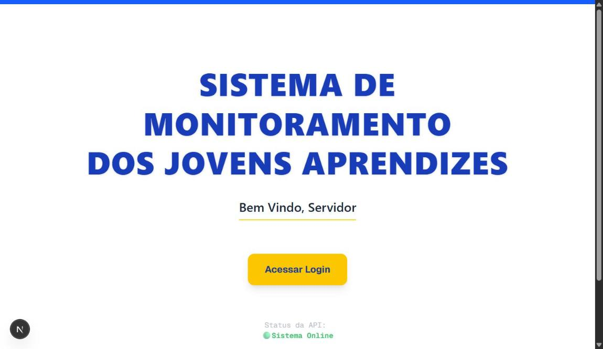
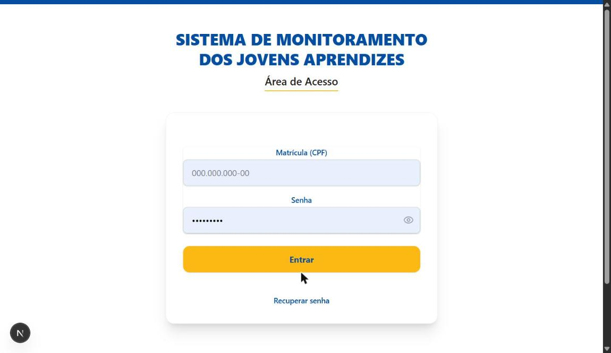
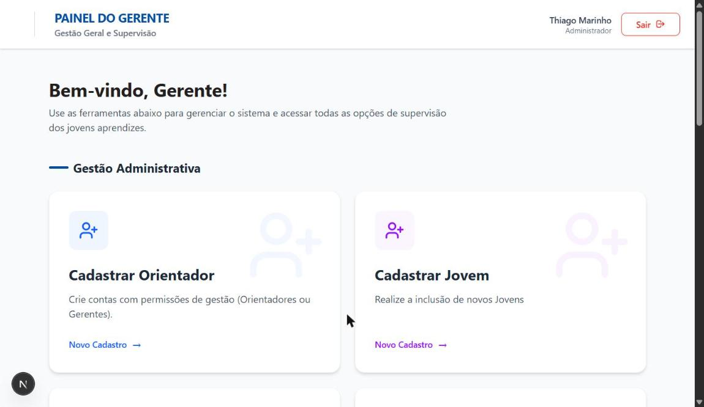
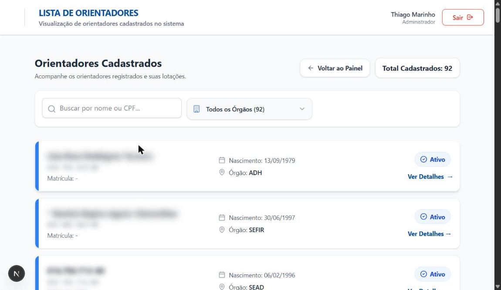
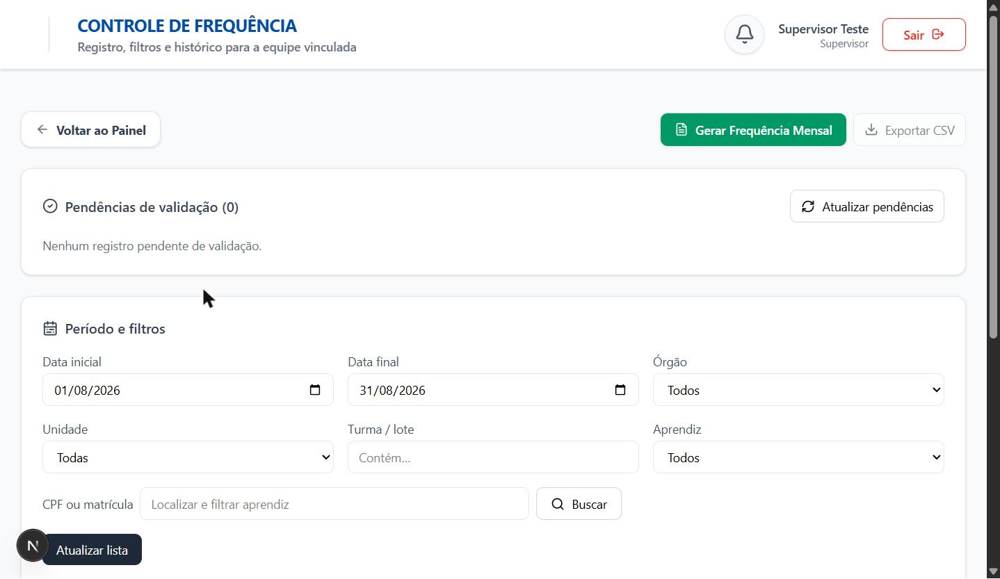
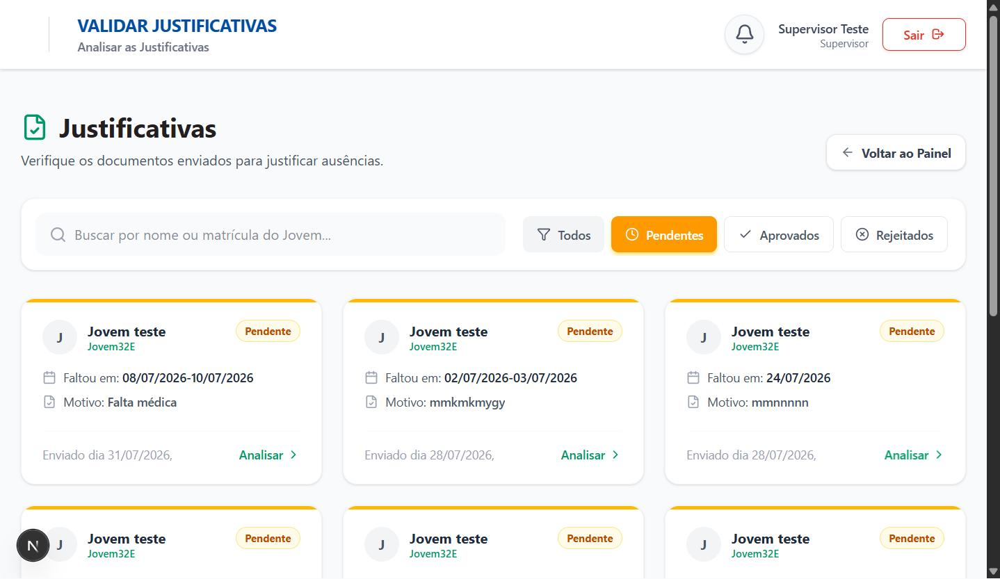
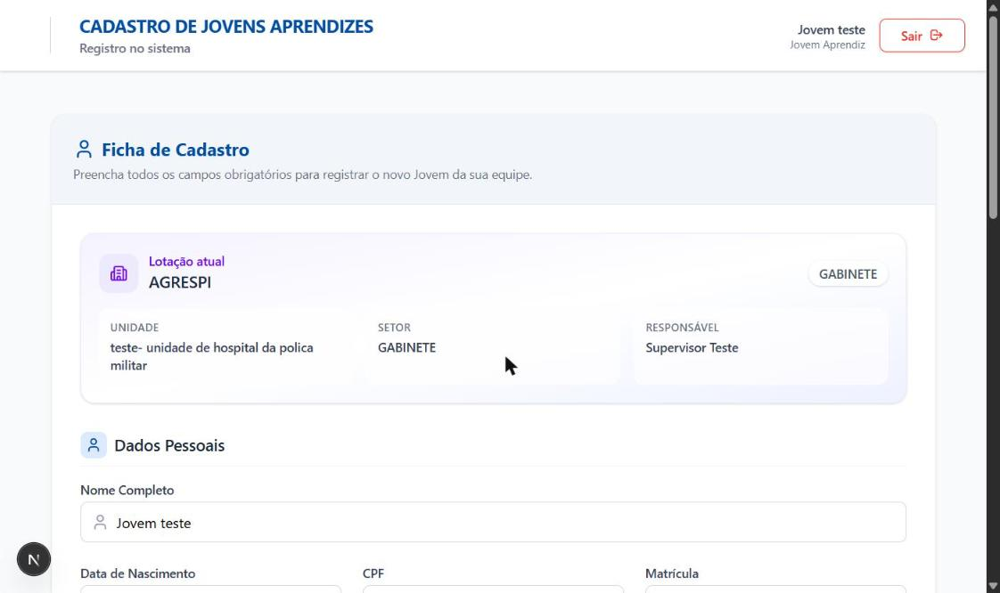
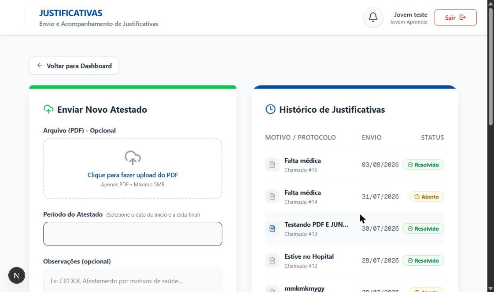

# Sistema de Gestão do Jovem Aprendiz — Frontend Case Study

> ⚠️ **Sobre este repositório:** este projeto foi desenvolvido durante meu estágio na **SEAD-PI (Secretaria de Estado da Administração do Piauí)** e está em uso por um órgão público. Por isso, **o código-fonte é confidencial e não pode ser publicado**. Este repositório documenta a aplicação — arquitetura, decisões técnicas e telas reais do sistema — como estudo de caso do meu trabalho.

## Visão geral

Sistema web para gerenciar o programa de Jovem Aprendiz de instituições públicas: controle de ponto eletrônico, frequência, ocorrências disciplinares e emissão de certificados, com quatro perfis de acesso distintos e permissões granulares por papel.

## Tecnologias

- **Next.js 16** (App Router) + **React 19**
- **Tailwind CSS v4** para estilização
- **NextAuth.js v4** com middleware de controle de acesso por papel (RBAC)
- **FullCalendar** para o calendário de frequência
- **Zod** para validação de formulários
- **React Multi Date Picker** para seleção de intervalos de datas
- **Lucide React** para ícones

## Perfis e funcionalidades

| Perfil | O que faz no sistema |
|---|---|
| **Administrador** | Cadastra orientadores e jovens aprendizes, gerencia lotação (órgão/unidade/setor), acompanha frequência geral, avalia desempenho e modera ocorrências/advertências |
| **Gerente / Coordenador** | Visão consolidada de todos os orientadores e jovens sob sua gestão |
| **Orientador / Supervisor** | Valida frequência e justificativas da própria equipe, abre advertências seguindo critérios pré-definidos, acompanha chamados |
| **Jovem Aprendiz** | Registra ponto eletrônico, consulta calendário de frequência, envia atestados/justificativas em PDF, acompanha ocorrências e mantém seus dados |

## Módulos principais

**Autenticação e controle de acesso** — proteção de rotas via middleware do Next.js, com verificação de sessão JWT e permissões específicas por perfil.

**Ponto eletrônico** — interface de registro de entrada/saída com detecção automática do tipo de batida e fechamento automático da frequência em caso de esquecimento.

**Frequência** — calendário mensal (FullCalendar) com status por dia (validado, pendente, falta, falta justificada), filtros por órgão/unidade/período e exportação em CSV.

**Justificativas e atestados** — upload de PDF com período de afastamento, fluxo de aprovação pelo orientador (pendente → aprovado/rejeitado).

**Ocorrências e advertências** — abertura de advertência pelo orientador segundo critérios objetivos (faltas injustificadas, atrasos frequentes, uso de celular etc.), com regra de 3 advertências = desligamento do programa.

**Gestão de lotação** — transferência de jovens entre órgãos, unidades e setores, com vínculo ao orientador responsável.

## Capturas de tela

Todos os dados abaixo são de ambiente de teste (usuários "Jovem teste" / "Supervisor Teste"); nomes reais de orientadores foram borrados nas telas administrativas.

<strong>Acesso e Administrador</strong>

 

| Tela inicial | Login |
|---|---|
|  |  |

| Painel do Gerente | Lista de orientadores |
|---|---|
|  |  |

<strong>Orientador / Supervisor</strong>

 

| Controle de frequência | Solicitar advertência |
|---|---|
|  |  |

<strong>Jovem Aprendiz</strong>

 

| Registro de ponto | Calendário de frequência |
|---|---|
|  |  |

## Minha contribuição

Fui responsável pelo desenvolvimento completo do frontend: construí as telas dos quatro perfis de usuário, implementei o middleware de autenticação e controle de acesso por papel, desenvolvi os módulos de ponto eletrônico e calendário de frequência (integração com FullCalendar), o fluxo de justificativas/atestados e o sistema de advertências e chamados administrativos.

## Arquitetura

O projeto segue a estrutura de rotas do App Router do Next.js, com separação clara entre componentes de servidor e cliente, middleware de autenticação centralizado e componentes de UI reutilizáveis entre os diferentes perfis. O design é totalmente responsivo, com atenção a acessibilidade.
