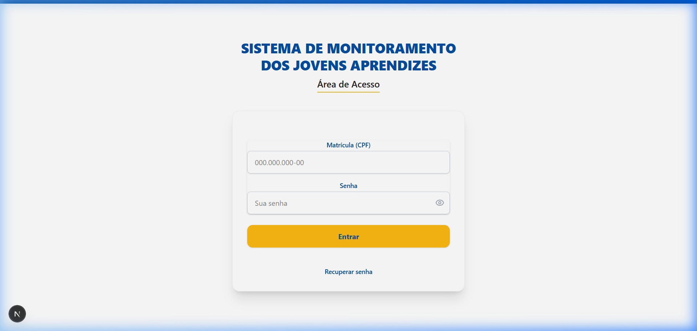
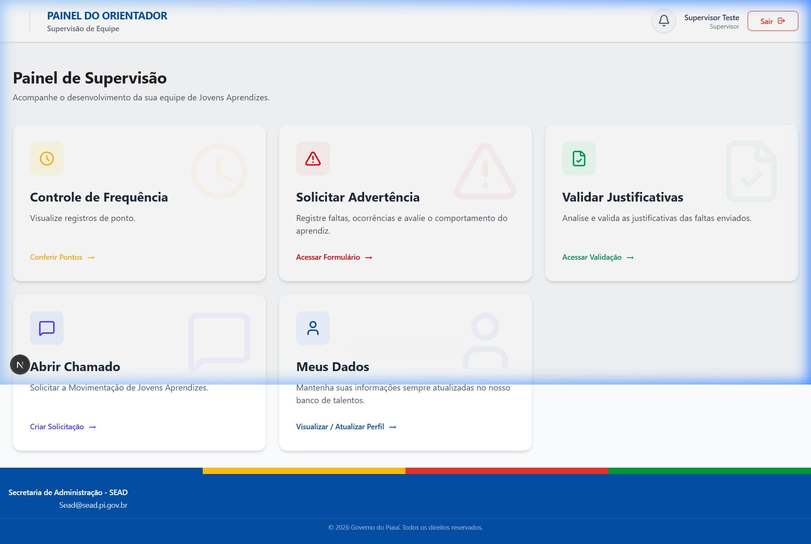
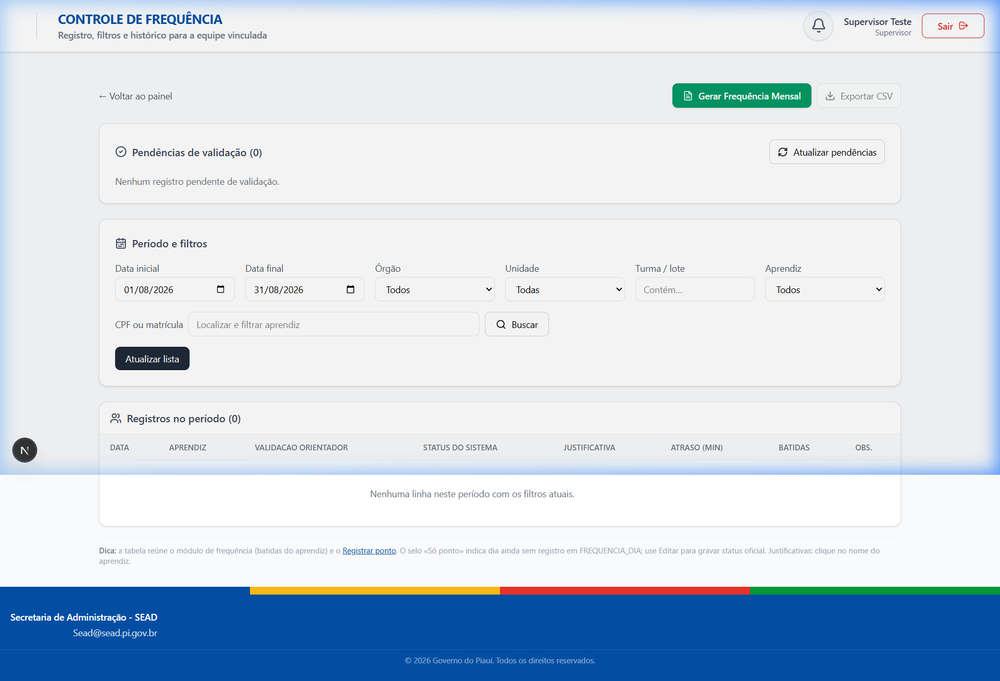
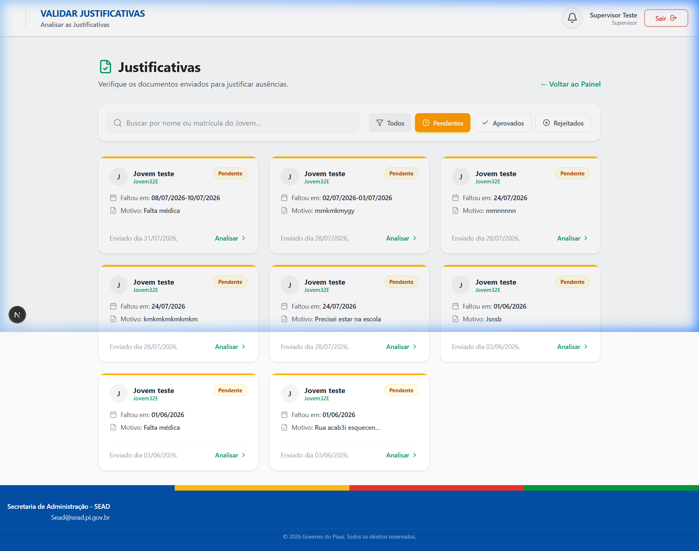

# 💼 Case Study: Sistema de Gestão do Jovem Aprendiz (Frontend)

> **Nota de Confidencialidade:** Este estudo de caso descreve a arquitetura, tecnologias e decisões de design da interface do usuário de um sistema de gestão corporativa. O código-fonte e dados sensíveis são privados e mantidos sob sigilo.

---

## 📌 Visão Geral do Projeto

O **Sistema de Gestão do Jovem Aprendiz** é uma aplicação web desenvolvida para automatizar e otimizar o acompanhamento operacional, comportamental e administrativo de jovens aprendizes alocados em órgãos públicos e instituições parceiras.

A interface frontend foi projetada para oferecer uma experiência fluida, responsiva e intuitiva para **4 perfis de usuários distintos** (Administrador, Gerente, Supervisor e Jovem Aprendiz), garantindo controle de acesso granular e facilidade no cumprimento das rotinas diárias (marcação de ponto, envio de atestados, acompanhamento de frequência e solicitações de apoio).

---

## 🛠️ Stack Tecnológica (Frontend)

- **Core Framework:** [Next.js 16](https://nextjs.org/) (App Router & Server/Client Components)
- **Biblioteca de Interface:** [React 19](https://react.dev/)
- **Estilização & Design System:** [Tailwind CSS v4](https://tailwindcss.com/) + CSS Customizado
- **Autenticação & Segurança:** [NextAuth.js v4](https://next-auth.js.org/) + Middleware RBAC
- **Ponto Eletrônico & Calendários:** FullCalendar (`@fullcalendar/react`, `@fullcalendar/daygrid`, `@fullcalendar/timegrid`)
- **Validação de Formulários:** [Zod](https://zod.dev/)
- **Manipulação de Datas:** React Multi Date Picker & React Date Object
- **Iconografia:** Lucide React

---

## 🚀 Principais Módulos & Funcionalidades Desenvolvidas

### 1. 🔑 Autenticação e Controle de Acesso Baseado em Papéis (RBAC)
- **Proteção de Rotas via Middleware:** Controle estrito de rotas no Next.js (`src/middleware.js`), impedindo acessos não autorizados entre os diferentes papéis.
- **Sessões Seguras:** Integração com NextAuth.js para persistência de tokens JWT e verificação de perfil em tempo de execução.
- **Fluxo de Recuperação de Senha:** Interface amigável para redefinição de credenciais com validação em tempo real via Zod.

---

### 2. ⏰ Registro de Ponto Eletrônico
- **Interface Intuitiva:** Componente visual de relógio de ponto e marcação de presença com feedback imediato de status e horário registrado.
- **Histórico & Espelho de Ponto:** Exibição clara dos registros diários e consolidação de horas.

---

### 3. 🗓️ Gestão Avançada de Frequência e Calendário
- **Visualização de Jornada:** Calendário interativo baseado em **FullCalendar** para exibição de dias trabalhados, faltas, folgas e eventos da instituição.
- **Lançamento de Justificativas e Atestados:** Formulários dinâmicos com seletores de múltiplas datas (`react-multi-date-picker`) e upload de documentos (PDF/imagens).
- **Painel de Validação para Supervisores:** Fluxo de aprovação/rejeição de atestados médicos com visualização prévia de documentos enviados.

---

## 🖼️ Demonstração Visual da Interface (UI)

### 1. 🔑 Tela de Autenticação (Login)

*Interface de login limpa e responsiva com autenticação via NextAuth.*

### 2. 📊 Painel Principal (Dashboard do Orientador / Supervisor)

*Dashboard modular com cards de navegação rápida para acompanhamento dos jovens aprendizes.*

### 3. 🗓️ Módulo de Controle de Frequência

*Filtros avançados por período, órgão, unidade e aprendiz para consulta e geração de relatórios.*

### 4. 📄 Validação de Atestados e Justificativas

*Painel para análise, aprovação ou indeferimento de justificativas enviadas pela equipe.*

---

### 4. 📊 Dashboards Customizados por Perfil

#### 👨‍💼 Painel do Gerente
- Monitoramento global de lotações e distribuição de jovens aprendizes por órgãos parceiros.
- Relatórios analíticos de frequência geral e emissão de advertências.
- Gerenciamento de chamados administrativos e programas de apoio psicológico.

#### 👨‍🏫 Painel do Supervisor
- Acompanhamento em tempo real da frequência diária da equipe sob sua supervisão.
- Módulo de avaliação de desempenho e acompanhamento comportamental dos aprendizes.
- Validação e deferimento de atestados médicos.

#### 👨‍🎓 Painel do Jovem Aprendiz
- Bater ponto rápido e visualizar espelho de ponto acumulado.
- Envio de certificados de cursos extracurriculares e comprovação de atividades.
- Canal direto para solicitação de apoio psicológico e abertura de chamados.

---

## 📐 Arquitetura & Boas Práticas no Frontend

```text
src/
├── app/
│   ├── (auth)/              # Rotas de Login e Recuperação de Senha
│   ├── (dashboard)/         # Grupos de Rotas Protegidas por Perfil
│   │   ├── admin/           # Visão Administrador
│   │   ├── gerente/         # Visão Gerente
│   │   ├── supervisor/      # Visão Supervisor
│   │   └── jovem-aprendiz/  # Visão Jovem Aprendiz
│   ├── components/          # Componentes Reutilizáveis (Header, Buttons, Selects)
│   └── api/                 # Handlers NextAuth e rotas internas de apoio
└── middleware.js            # Proteção de rotas RBAC (Role-Based Access Control)
```

### Destaques de Engenharia de Software:
1. **Componentização Modular:** Criação de componentes genéricos e altamente reutilizáveis como `SearchableSelect`, `InternalHeader`, `AuthErrorAlert` e seletores assíncronos.
2. **Separação de Responsabilidades:** Utilização de componentes de servidor (Server Components) para renderização inicial rápida e componentes de cliente (Client Components) estritamente onde há interatividade (formulários, calendários e mapas).
3. **UX/UI Acessível e Responsiva:** Layouts totalmente adaptáveis a dispositivos móveis e desktops, utilizando padrões modernos de acessibilidade e microinterações.

---

## 🎯 Minhas Principais Contribuições

- **Desenvolvimento dos Telas e Componentes das 4 Visões:** Construção e integração das rotas completas do painel (Dashboard do Jovem Aprendiz, Supervisor e Gerente).
- **Módulo de Atestados e Justificativas:** Criação da interface de upload, validação e listagem de atestados de frequência.
- **Implementação do Ponto e Calendário:** Construção da interface do relógio de ponto e visualização de eventos no FullCalendar.
- **Sistema de Advertências e Chamados:** Implementação de telas administrativas para registro, controle e consulta de advertências disciplinares.

---

## 💡 Desafios Solucionados

- **Validação de Permissões no Roteamento:** Garantir que um Jovem Aprendiz não acesse rotas do Gerente ou Supervisor, resolvido com um middleware centralizado de NextAuth inspecionando permissões JWT em tempo de requisição.
- **Upload e Seleção Multidatas em Atestados:** Permitir a seleção de múltiplos dias de afastamento de forma fluida sem degradar a performance da interface.
